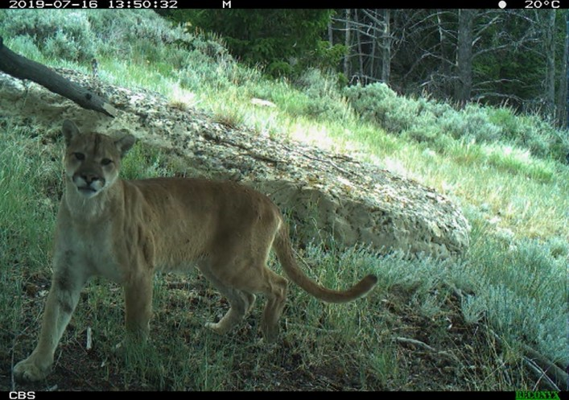

# An ‘Attention Capture Device’ for capturing facial images of pumas or other wildlife in camera trapping studies

### Peter Alexander
### <a href="https://www.beringiasouth.org/">Craighead Beringia South</a> - Kelly, WY

   

 

The Attention Capture Device (ACD) was designed to help capture facial images of pumas in camera trapping studies, in order to improve researcher ability to identify individual pumas. See <a href="https://onlinelibrary.wiley.com/doi/10.1002/ece3.8536">our article published in Ecology & Evolution</a> for more details on the research; here, I describe the technical design of the ACD.

I designed this device to be very low-cost, low-power, and as simple as possible to deploy alongside a conventional camera trap. The ACD operates entirely independently of a camera trap. It is mounted adjacent to a camera trap (of any type), with the sensor aimed in the same direction as the camera’s; when a passing animal triggers the camera, it will also trigger the ACD.

When triggered, the ACD’s two LED lights will illuminate (mimicking eye-shine), and it will play a sound. I programmed the units to play the sound of a cougar kitten ‘chirp’, although any sound could be programmed into the chip (with some work). The target animal, with any luck, will turn its attention to the ACD to investigate, thereby presenting its face to the camera as well:

## Basic design

   

 

The electrical components are all reletively inexpensive, at roughly $15 per ACD; The waterproof case (I used a Pelican 1020 micro-case) is the most expensive part at about $15-$25 per box; sometimes cheap used ones can be found (e.g., on eBay). Note that additional hardware is required for uploading code to the Atmega (computer, Arduino board, cables, breadboard, etc).

## Arduino platform
The device uses the <a href="https://www.arduino.cc/">Arduino**®** framework</a> to operate. Arduino is an open-source hardware/software system commonly used by hobbyists, students or other ‘prototypers’ for lightweight automated or robotic applications. There is a large online community for Arduino, and almost any question can be answered by searching the Arduino forums or google.

To reduce the power as much as possible, I used a 'barebones' setup, with an Atmega328 as the controller. An Arduino Uno board was used to upload the programming to the Atmega : https://docs.arduino.cc/built-in-examples/arduino-isp/ArduinoToBreadboard

## Schematic
The design is based around the Atmega328p, with a voltage regulator, an on switch, a transistor to amplify the sound, a few capacitors, and the delay timer to change how quickly the sound is activated after being triggered. I had circuit boards printed at <a href="https://oshpark.com/">OSH Park</a>, drawn to include an 11-pin screw terminal to make attaching the components (PIR, LED lights, battery pack, speaker) easy.

## Programming
All programming was written with the Arduino IDE: https://www.arduino.cc/en/software

The <a href="code/controller.ino">main ACD code</a> controls the manner in which the unit starts up, goes into and out of sleep mode, activates the lights and speaker, and calls the libraries for sleep and audio functions.

More on the sleep libraries found here: https://www.nongnu.org/avr-libc/user-manual/group__avr__sleep.html and https://www.gammon.com.au/power

## Sound
I use an 8 Ohm speaker. For simplicity and power-savings, the sound is converted from wav and coded directly into the controller code:  see https://playground.arduino.cc/Code/PCMAudio/

In my code, I included several short audio clips of puma 'chirps'; when triggered they are played in random order.

## PIR
The PIR is a standard HC-SR501, but modified to bypass its voltage regulator and run off of the 3.3V output of the microcontroller:
https://forum.mysensors.org/topic/1088/battery-powered-pir

I also attached a small tube on front of the PIR window to act as a 'blinder' so motion on the periphery does not trigger the ACD too early.

## Power
The ACD runs on 4 AA batteries. I used Energizer "ultimate lithium" batteries, and could expect the ACD to run for several months.

## Settings
The only "settings" that could be changed when deploying the ACD are on the PIR <a href="[code/controller.ino](https://create.arduino.cc/projecthub/electropeak/pir-motion-sensor-how-to-use-pirs-w-arduino-raspberry-pi-18d7fa)">(see here)</a>, and the built-in delay timer. Details:
 <ul>
  <li>PIR 3 pin 'jumper': leave on H</li>
  <li>PIR sensitivity: turned clockwise for higher sensitivity </li>
  <li>PIR timeout: turned counter-clockwise for a short timeout</li>
  <li>Delay timer : turn clockwise for a longer delay between motion and sound (note lights are always activated immediately)</li>
</ul> 

## Camera trapping setup
The device is mounted immediately next to a camera trap; I used 1/4" bolts to attach both camera and ACD to a small piece of wood, which was then strapped to a tree:

The device is simply switched on at deployment; a series of beeps and clicks indicate a countdown to activation. If altering the PIR or the delay timer, the unit should be reset by switching off and back on.

I had the best results when I used a scent lure, placed on the ground +/- 3m from the camera in the center of the field of view. Setting a short delay with the delay timer, an animal can fully enter the camera's field of view to first investigate the scent, before the sound is triggered.

## Final thoughts
 <ul>
  <li>I designed this in 2017-2018; undoubtedly some of the software and hardware has become obsolete, or better options have become available</li>
  <li> The sound is fairly poor quality; not sure what effect this may have had on animal reactions (curiosity vs fear) </li>
 <li> Animals were sometimes a little too far back, or too far to the side to capture a clear image of their face - improvements to the camera type/placement/lens could help </li>
 <li> I typically used Reconyx Hyperfire or Ultrafire cameras. Videos seemed to have a higher chance of capturing a face image (i.e., a quick glance was potentially missed if a camera was set to take still images).
 <li> Motion was not detected 100%; a higher quality PIR and/or improving my circuit design could improve this</li>
 <li> Obviosuly, this technique eliminates the 'covertness' of a typical camera trap. Prey species (elk and deer for my study) had mixed reactions, and were sometimes quite 'spooked'; bears sometimes pulled it down; potential human reactions should also be considered when choosing where to place these traps </li>
</ul>

####

